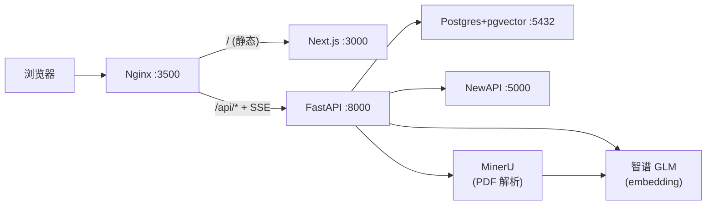

# 04 架构设计（Architecture Design）

> PMBOK 第 7 章：项目范围管理 之 设计 / 架构产出物。

---

## 1. 系统总览（Mermaid）

完整架构图见 [system-architecture.md](system-architecture.md)；下面是简化版（一眼看容器）：

---

## 2. 架构原则

1. **调用层解耦**：botgroup 只对 NewAPI 兼容协议；换厂商只改 base_url
2. **存储层解耦**：解析 (MinerU) / 检索 (BM25+向量) / LLM (NewAPI) 各跑各的容器，单点故障隔离
3. **可观测优先**：所有跨层调用都进 audit_log
4. **可逆优先**：每个 feature 单独 commit；新方案先在 plan.md 里沉淀再写代码

---

## 3. 关键子系统

| 子系统 | 入口 | 文档 |
| --- | --- | --- |
| **整体架构图** | — | [system-architecture.md](system-architecture.md) |
| **中间件清单** | — | [middleware-inventory.md](middleware-inventory.md) |
| **信息流向** | — | [data-flow.md](data-flow.md) |
| **编排引擎（Orchestrator）** | `backend/app/orchestrator/msghub.py` | [adr/0002-orchestrator-choice.md](../adr/0002-orchestrator-choice.md) |
| **RAG 三件套** | `backend/app/services/rag_retriever.py` + `local_retriever.py` | [rag-design.md](rag-design.md) / [hybrid-bm25-rag.md](hybrid-bm25-rag.md) |
| **句窗上下文** | `backend/app/services/sentence_window.py` | [sentence-window-context.md](sentence-window-context.md) |
| **技能中心** | `backend/app/skills/registry.py` | [skill-center.md](skill-center.md) |
| **审计** | `backend/app/services/audit.py` | [09-operations/user-mgmt-audit-log.md](../09-operations/user-mgmt-audit-log.md) |

---

## 4. 部署架构

详见 [08-deployment/README.md](../08-deployment/README.md)。

容器清单（docker-compose.yml 同步维护）：

| 服务 | 镜像 | 端口 | 说明 |
| --- | --- | --- | --- |
| frontend | 自建 Next.js | 3000 (内) | 由 Nginx 反代 |
| backend | 自建 FastAPI | 8000 (内) | 仅内网 |
| nginx | nginx:1.27 | 3500 (外) | stream 同时承载 HTTP/HTTPS |
| postgres | pgvector/pg16 | 5432 (内) | 持久化 |
| new-api | calciumion/new-api | 5000 (内) | OpenAI 兼容 LLM 网关 |

---

## 5. 数据架构（PostgreSQL）

关键表（详见 [`backend/app/db/models.py`](../../backend/app/db/models.py)）：

| 表 | 作用 |
| --- | --- |
| `users` | 用户 + 角色（admin / user）+ 状态 |
| `bots` | 机器人（model + persona + temperature） |
| `groups` | 群组（mode + max_rounds） |
| `group_members` | 群组成员（含 bot / 观察者） |
| `messages` | 消息（含引用 JSON） |
| `attachments` | 通用附件（KB / chat 共用） |
| `runs` | 任务运行实例（含多轮 + tokens_used） |
| `knowledge_bases` | 知识库（scope + is_public + ragflow_dataset_id 兼容列） |
| `kb_documents` | KB 内的文档（status: pending/parsing/ready/failed） |
| `kb_chunks` | 切片（含 bbox_json + snippet + embedding） |
| `bot_kb` | bot ↔ KB 挂载表 |
| `skills` | 技能定义（注册中心持久化） |
| `bot_skills` | bot ↔ 技能挂载 |
| `system_policies` | 群组策略 / 防火墙（按 group_id 应用） |
| `audit_logs` | 全量操作审计 |

迁移由 Alembic 管理：[`backend/alembic/`](../../backend/alembic/)。

---

## 6. 安全架构

详见 [07-testing/security-audit-plan.md](../07-testing/security-audit-plan.md) 与 [security-audit-report.md](../07-testing/security-audit-report.md)。

关键点：

- 密码 bcrypt（cost=12）
- 会话 JWT（HttpOnly cookie），`AUTH_SECRET` 来自 `.env`
- 所有写操作入 `audit_log` 含 client_ip
- `is_admin()` 校验路由级而非字段级

---

## 7. 关键设计决策（ADR）

详见 [../adr/](../adr/)。

- [ADR-0001：三层部署架构](../adr/0001-three-tier-compose.md)
- [ADR-0002：自研编排器 vs AgentScope](../adr/0002-orchestrator-choice.md)
- [ADR-0003：流式用 SSE 而非 WebSocket](../adr/0003-sse-vs-websocket.md)
- [ADR-0004：KB 检索 = pgvector + 智谱 GLM embedding（不再引入 RAGFlow）](../adr/0004-kb-local-rag.md)

---

## 8. 相关链接

- [05 详细设计](../05-design/)
- [06 实现记录](../06-implementation/)
- [08 部署](../08-deployment/)