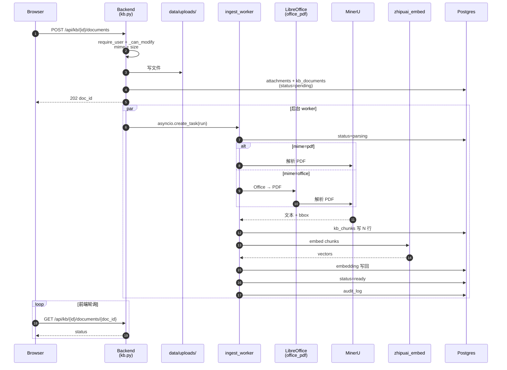
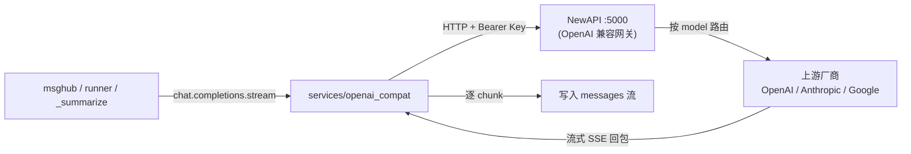
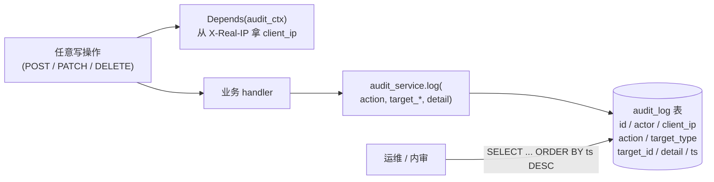
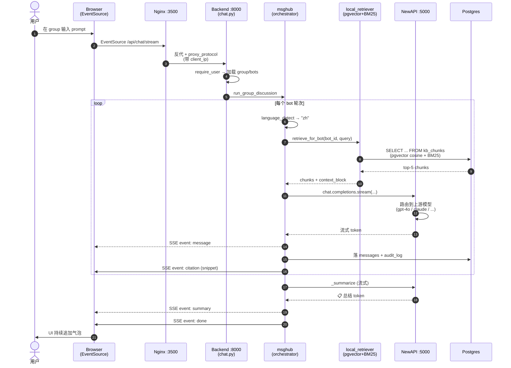

# 信息流向（Data Flow）

> PMBOK § 7.1 / 端到端"用户操作 → 系统响应"的完整数据走向。
> 配套：[system-architecture.md](system-architecture.md) / [middleware-inventory.md](middleware-inventory.md)

---

## 1. 总览：六条主数据流

| # | 流 | 起点 | 终点 | 协议 | 关键代码 |
| --- | --- | --- | --- | --- | --- |
| F1 | 用户认证 | 浏览器 | backend `/api/auth/*` | HTTPS + Cookie | [`backend/app/api/auth.py`](../../../backend/app/api/auth.py) |
| F2 | 流式聊天 | 浏览器 | backend `/api/chat/stream` | HTTPS + SSE | [`backend/app/api/chat.py`](../../../backend/app/api/chat.py) + [`backend/app/orchestrator/msghub.py`](../../../backend/app/orchestrator/msghub.py) |
| F3 | KB 上传 + 解析 | 浏览器 | backend → workers → MinerU | HTTPS + multipart | [`backend/app/api/kb.py`](../../../backend/app/api/kb.py) + [`workers/ingest_worker.py`](../../../backend/app/workers/ingest_worker.py) |
| F4 | KB 检索 + 引用 | orchestrator | local_retriever (pgvector + BM25) | JS chunks | [`backend/app/services/local_retriever.py`](../../../backend/app/services/local_retriever.py) |
| F5 | LLM 调用 | orchestrator | NewAPI → 厂商 | HTTP + JSON | [`backend/app/services/*`](../../../backend/app/services/) |
| F6 | 审计落库 | 所有写操作 | Postgres `audit_log` | asyncpg | [`backend/app/services/audit.py`](../../../backend/app/services/audit.py) |

---

## 2. F1 用户认证

```
Browser
  │ POST /api/auth/login {username, password}
  ▼
Nginx (:3500 → :3501)
  │
  ▼
Frontend (Next.js) —— 不参与登录
  │ （请求是 /api/*，前端直接打到 nginx 同源反代 backend）
  ▼
Backend /api/auth/login (api/auth.py)
  │ 1. 查 User 表（SQLAlchemy）
  │ 2. bcrypt 校验
  │ 3. set_session_cookie(response, JWT)
  │ 4. audit_log("auth.login")
  ▼
Postgres users + audit_log
  │
  ▼ （响应）
Browser 拿到 HttpOnly Cookie，后续请求自动带
```

**字段**：`Set-Cookie: botgroup_session=<JWT>; HttpOnly; Max-Age=604800; SameSite=lax`

---

## 3. F2 流式聊天（最复杂）

```
Browser
  │ POST /api/chat/stream {group_id, prompt}
  │   EventSource('/api/chat/stream?...')
  ▼
Nginx（proxy_buffering off）
  ▼
Backend /api/chat/stream (api/chat.py)
  │ 1. require_user → 当前用户
  │ 2. 加载 group + 群内 bots
  │ 3. 加载 prior_history（_load_prior_history，同 task 跨轮）
  │ 4. 调用 orchestrator.run_group_discussion(...)
  ▼
msghub.run_group_discussion (orchestrator/msghub.py)
  │
  │  对当前轮次的每个 bot：
  │  ┌─────────────────────────────────────────────────────────────────┐
  │  │ runner.run_one_turn(bot, prompt, prior)                       │
  │  │   1. 检测用户语种（services/language_detect）                  │
  │  │   2. 构造 system prompt = persona + [回复语言] + 引用块         │
  │  │   3. RAG 检索（services/rag_retriever → local_retriever）      │
  │  │      pgvector cosine + BM25 + RRF 融合（唯一路径）            │
  │  │   4. 流式调 NewAPI（services/openai_compat）                   │
  │  │   5. 边流式输出 → SSE event: message                          │
  │  │   6. 引用 chip 注入（@@MENTION_n@@）                          │
  │  │   7. 落库 messages（含 citations JSON）                       │
  │  │   8. audit_log("chat.bot_turn")                               │
  │  └─────────────────────────────────────────────────────────────────┘
  │
  │  全部 bot 发言完：
  │  msghub._summarize(...)
  │   1. 收集所有 bot 发言
  │   2. 注入 [回复语言] system 模板
  │   3. 调 NewAPI 生成 📋 总结
  │   4. SSE event: summary
  │   5. 落库
  │   6. audit_log("chat.summarize")
  │
  │ SSE event: done
  ▼
Browser EventSource 逐条追加到 UI（ChatBubble）

**F2 内部细节（Mermaid）**：

```mermaid
flowchart TB
    Start([run_group_discussion 进入])
    Start --> LoadPrior[加载 prior_history<br/>_load_prior_history]
    LoadPrior --> LoopBot{对每个 bot}

    LoopBot -- 有 --> OneTurn[runner.run_one_turn]
    OneTurn --> LD[language_detect → zh/en]
    LD --> BuildSP[构造 system prompt<br/>persona + 回复语言 + 引用块]
    BuildSP --> RAG[rag_retriever → local_retriever<br/>BM25 + pgvector + RRF]
    RAG --> Stream[流式调 NewAPI<br/>openai_compat.stream]
    Stream --> Chip[注入 @@CITATION_n@@]
    Chip --> Persist[落 messages + audit_log]
    Persist --> LoopBot

    LoopBot -- 全部完成 --> Summarize[_summarize]
    Summarize --> SumSP[注入 [回复语言] 模板]
    SumSP --> SumStream[NewAPI 流式生成 📋 总结]
    SumStream --> Done[SSE event: done]

    Done --> Browser([Browser UI 持续追加])
```

**SSE 事件**：

```
event: message   data: {id, role:"assistant", bot_id, content, ...}
event: citation  data: {chunk_id, snippet, page, bbox}
event: summary   data: {content, ...}
event: done      data: {run_id, tokens_used, ...}
```

---

## 4. F3 KB 上传 + 解析

```
Browser
  │ POST /api/kb/{kb_id}/documents  (multipart/form-data, file=...)
  ▼
Backend /api/kb/{kb_id}/documents (api/kb.py)
  │ 1. require_user + _can_modify
  │ 2. 校验 mime + size
  │ 3. 写文件 → data/uploads/{att_id}.{ext}
  │ 4. attachments 表 +1 行（group_id=NULL）
  │ 5. kb_documents 表 +1 行（status=pending）
  │ 6. asyncio.create_task(ingest_worker.run(doc_id))
  │ 7. 立即返回 202 + doc_id
  ▼
Frontend 轮询 GET /api/kb/{kb_id}/documents/{doc_id}
  │ 每 2 秒拉一次 status
  ▼
ingest_worker.run (workers/ingest_worker.py)
  │ 1. status → parsing
  │ 2. mime 分支：
  │     ├─ pdf → services/mineru.py → 文本 + bbox
  │     └─ office（doc/xlsx/pptx）→ services/office_pdf.py（LibreOffice 转 PDF）
  │                                   → MinerU 解析
  │ 3. 分块（按页/段）→ kb_chunks 写 N 行（含 bbox_json + snippet）
  │ 4. （可选）services/zhipuai_embed.py 生成 embedding 写回
  │ 5. status → ready
  │ 6. audit_log("kb.doc.ingested")
  │
  │ 任何一步抛异常：
  │   status → failed + 写 error 字段
  ▼
Frontend 拿到 status=ready 即可用于检索
```

**F3 流程图（Mermaid）**：



---

## 5. F4 KB 检索 + 引用

```
orchestrator 拿到当前 prompt
  │
  ▼
rag_retriever.retrieve_for_bot(bot_id, query, session)
  │
  └─ local_retriever.retrieve(bot_id, query, session, top_k=top_k, top_n=top_n)
        ├─ BM25 over kb_chunks.snippet              (兜底)
        ├─ pgvector cosine over kb_chunks.embedding (主召回)
        ├─ RRF 融合
        └─ 返回 top-k [{chunk_id, snippet, page, bbox_json, score, ...}]
  │
  ▼
msghub 拿 snippet 列表注入 system prompt：
  "... 参考资料：
   [1] {snippet_1}（page {p1}）
   [2] {snippet_2}（page {p2}）
   ...
 引用时用 [n] 标注 ..."
  │
  ▼
LLM 输出含 [1] [2] → 前端替换为 @@CITATION_1@@ @@CITATION_2@@
  │ markdown 渲染后：
  │ <button class="cite-chip" data-cid=1>[1]</button>
  │
  ▼
点击 chip → CitationDrawerContext.open(chunk_id)
  │
  ▼
ChunkPreview / PdfViewerWithBbox 拉 /api/kb/{kb_id}/chunks/{chunk_id}
  │   → bbox + snippet
  │   → PDF.js 跳页 + 画红色 bbox 框
```

**F4 流程图（Mermaid）**：

```mermaid
flowchart LR
    Q[query] --> LR[local_retriever<br/>BM25 + pgvector cosine]
    LR -->|RRF 融合| Top[top-k chunks]
    Top --> SP[注入 system prompt<br/>参考资料 [n] snippet page]
    T[LLM 输出<br/>含 [n]] --> Rep[前端替换为<br/>@@CITATION_n@@]
    Rep --> Chip["cite-chip button"]
    Chip -->|点击| Drawer[CitationDrawerContext.open]
    Drawer --> API[GET /api/kb/id/chunks/id]
    API --> PDF[PDF.js 跳页 + bbox]
```

---

## 6. F5 LLM 调用

```
msghub / runner / summarize
  │
  ▼
services/openai_compat.chat_completions(
    base_url=NEWAPI_BASE_URL,    # http://new-api:5000/v1
    api_key=NEWAPI_API_KEY,
    model=bot.model,              # gpt-4o / claude / ...
    messages=[...],
    max_tokens=max_tokens_for_task, # 2048 / 4096 / 1024
    stream=True,
    timeout=REQUEST_TIMEOUT_SECONDS # 120
)
  │
  ▼
NewAPI（内部按 model 路由）
  │
  ▼
上游厂商 API（OpenAI / Anthropic / Google / ...）
  │
  ▼ （流式 SSE 回包）
runner 逐 chunk 解析 → 写入 message 流
```

**F5 流程图（Mermaid）**：



---

## 7. F6 审计落库

每个写操作都走同一模板：

```python
@router.post("/...")
async def handler(
    ...,
    ctx: audit_service.AuditContext = Depends(audit_service.audit_ctx),
):
    await audit_service.log(
        session, ctx,
        action="kb.create",          # 动词.名词
        target_type="kb",
        target_id=str(kb.id),
        target_name=kb.name,
        detail={"foo": "bar"},
    )
```

`AuditContext` 从 `X-Real-IP` / `proxy_protocol` 拿真实 client_ip，写入 `audit_log` 表。

查询：`SELECT * FROM audit_log ORDER BY created_at DESC LIMIT 50;`

**F6 流程图（Mermaid）**：



---

## 8. 端到端时序（一句话聊天）



> 渲染器无 Mermaid 支持时，可参考 [data-flow.txt](data-flow.txt)（ASCII 备份）。

---

## 9. 关联文档

- [04-architecture/system-architecture.md](system-architecture.md) — 整体架构
- [04-architecture/middleware-inventory.md](middleware-inventory.md) — 中间件清单
- [04-architecture/README.md](README.md) — 子系统索引
- [04-architecture/rag-design.md](rag-design.md) — RAG 详细设计
- [04-architecture/sentence-window-context.md](sentence-window-context.md) — 上下文窗口
- [06-implementation/citation-stability.md](../06-implementation/citation-stability.md) — 引用稳定