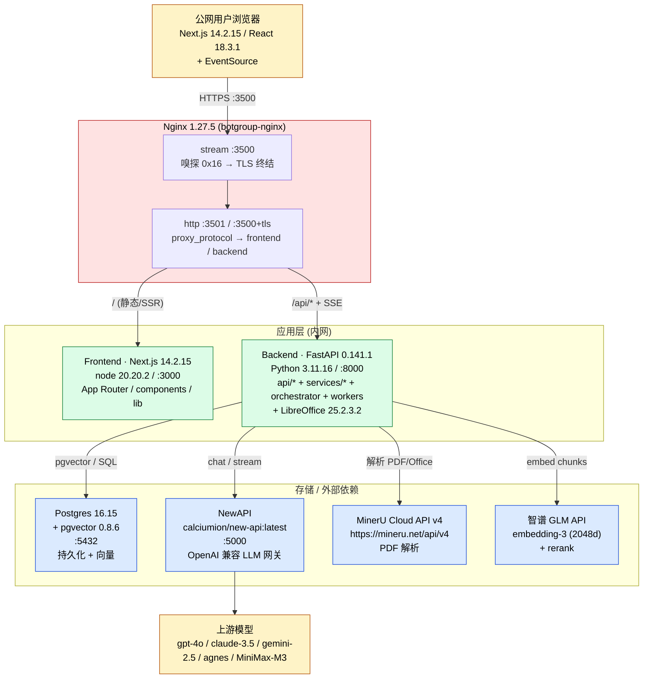
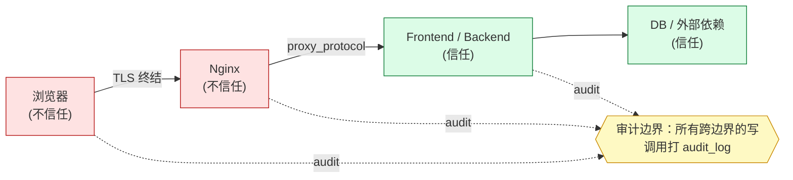

# 系统整体架构图（System Architecture）

> PMBOK § 7.1 / 架构设计 — 一图说明整个 botgroup 怎么组装。
> 配套：[middleware-inventory.md](middleware-inventory.md) / [data-flow.md](data-flow.md)

---

## 1. 一图概览（Mermaid）

> 渲染器无 Mermaid 支持时，可参考 [system-architecture.txt](system-architecture.txt)（ASCII 备份）。

---

## 2. 三层划分

| 层 | 组件 | 职责 |
| --- | --- | --- |
| **接入层** | Nginx | TLS 终结、HTTP/HTTPS 同端口分流、反代 + PROXY 协议 |
| **应用层** | Frontend (Next.js) + Backend (FastAPI) | 渲染 + 业务逻辑 |
| **存储 / 外部依赖层** | Postgres (pgvector) + NewAPI + MinerU + 智谱 GLM | 持久化 + LLM + 解析 + 向量 |

---

## 3. 信任边界

- 浏览器 ↔ Nginx：HTTPS，TLS 终结在 Nginx
- Nginx ↔ 应用：内网 HTTP + proxy_protocol（拿真实 client_ip）
- Backend ↔ DB：内网 TCP，密码在 `.env`
- Backend ↔ NewAPI：内网 HTTP，API Key 在 `.env`

---

## 4. 部署拓扑

单机 Docker Compose（详见 ADR-0001 / [08-deployment](../08-deployment/)）：

| 容器 | 镜像 | 暴露端口 | 数据持久化 |
| --- | --- | --- | --- |
| `botgroup-frontend` | 自建 | 3000（内） | — |
| `botgroup-backend` | 自建 | 8000（内） | `data/uploads/` |
| `botgroup-nginx` | nginx:1.27 | **3500（外）** | — |
| `botgroup-postgres` | pgvector/pg16 | 5432（内） | docker volume `pgdata` |
| `new-api` | calciumion/new-api | 5000（内） | docker volume `newapi-data` |

> 公网**只**有 Nginx 暴露 3500。所有应用容器只走内网。

---

## 5. 关键不变量（Invariants）

1. **会话鉴权**：所有 `/api/*` 写操作必须经过 `require_user` 或 `require_admin`
2. **审计**：所有写操作 → `audit_log`（含 client_ip + actor + action + target）
3. **KB 隔离**：`is_public` + `scope` 决定可见性；`_resolve_kb` 是统一入口
4. **流式输出**：`/api/chat/stream` 走 SSE；Nginx `proxy_buffering off`
5. **数据不丢**：所有 chat 消息 + audit 落 Postgres；KB 文件落 `data/uploads/`

---

## 6. 关联文档

- [04-architecture/README.md](README.md) — 子系统索引
- [04-architecture/middleware-inventory.md](middleware-inventory.md) — 中间件清单
- [04-architecture/data-flow.md](data-flow.md) — 信息流向
- [08-deployment/README.md](../08-deployment/) — 部署清单
- [ADR-0001](../adr/0001-three-tier-compose.md) — 部署架构决策