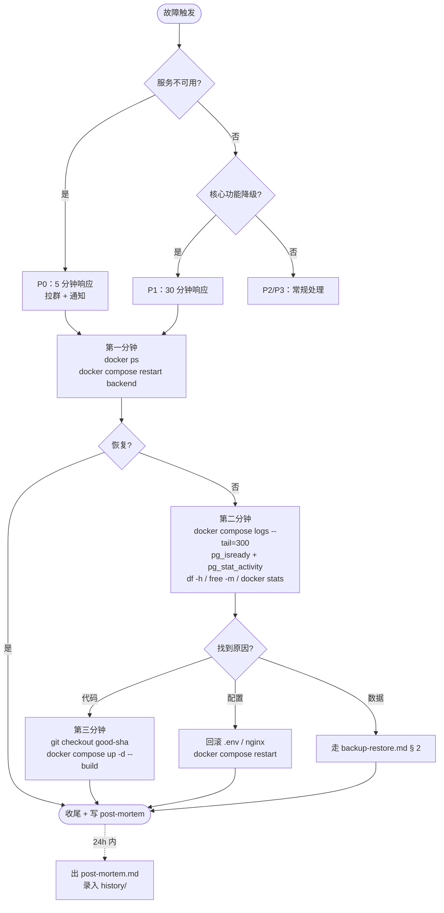

# 应急响应（Incident Response）

> PMBOK § 11.6 / PMP 风险应急策略。

## 1. 响应级别

| 级别 | 触发 | 响应 |
| --- | --- | --- |
| P0 | 服务完全不可用 | 立即拉群；on-call 5 分钟内响应 |
| P1 | 核心功能降级（如 chat 流式断开） | 30 分钟内响应 |
| P2 | 非核心功能异常 | 当工作日内响应 |
| P3 | 体验 / 文档 | 排入下个 sprint |

## 2. P0 / P1 响应流程



### 2.1 第一分钟（止血）

```bash
# 1. 看健康
docker ps

# 2. 重启单个服务（最常见止血）
docker compose restart backend

# 3. 不行就全套起
docker compose up -d
```

### 2.2 第二分钟（定位）

```bash
# 后端日志
docker compose logs --tail=300 backend

# 看错误模式（5xx / Traceback / 异常）
docker compose logs backend | grep -E 'Traceback|HTTP/.* 5[0-9][0-9]|FATAL'

# 数据库
docker exec botgroup-postgres pg_isready -U botgroup
docker exec botgroup-postgres psql -U botgroup -d botgroup -c "SELECT pid, state, query FROM pg_stat_activity WHERE state != 'idle' LIMIT 20;"

# 磁盘 / 内存
df -h
free -m
docker stats --no-stream
```

### 2.3 第三分钟（回滚）

如果代码改动引起：

```bash
git log --oneline -5
# 找到上一个好的 commit
git checkout <good>
docker compose up -d --build
```

### 2.4 复盘

24h 内出 [post-mortem.md](post-mortem-template.md)（模板待补）+ 录入 [history/](../history/)。

## 3. 常见故障速查

| 症状 | 直接定位 | 见 |
| --- | --- | --- |
| `502 Bad Gateway` | backend 崩 / 没起来 | 2.1 |
| `alembic upgrade head` 失败 | 看 migration 文件 | [backup-restore.md](backup-restore.md) § 3.3 |
| LLM 全部 401 | NewAPI key 失效 | 检查 `.env` 中 `NEWAPI_API_KEY` |
| 流式断流 | NewAPI 超时 / nginx 缓冲 | `proxy_buffering off` 已在 nginx 配置 |
| 引用全空 | pgvector / 智谱 GLM 配置问题 | [04-architecture/rag-design.md](../04-architecture/rag-design.md) |
| 上传文档卡在 `parsing` | MinerU 容器不可用 | `docker logs mineru`（如部署） |

## 4. 联系方式

| 角色 | 联系方式 |
| --- | --- |
| On-call | 运维群 |
| DBA | 数据库群 |
| 安全审计 | 内审组 |
| 业务方代表 | 业务群 |