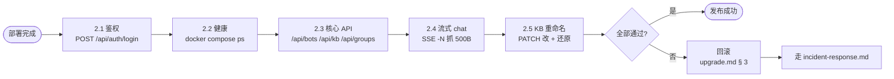

# 烟囱测试（Smoke Test）

> 每次升级 / 部署后必跑。



## 1. 前置

```bash
# 把 <your-host> 换成你的实际部署地址
HOST=https://<your-host>:3500
COOKIE=/tmp/botgroup.cookies
rm -f $COOKIE
```

> 占位符：`<your-host>` 是部署机域名或 IP；`admin` 密码用 `.env` 中 `AUTH_BOOTSTRAP_PASSWORD` 设的值。

## 2. 步骤

### 2.1 鉴权

```bash
curl -fsS -c $COOKIE -X POST $HOST/api/auth/login \
  -H 'Content-Type: application/json' \
  -d '{"username":"admin","password":"<your-bootstrap-password>"}' >/dev/null
# expect 200
```

### 2.2 健康

```bash
docker compose ps | grep -E 'backend|frontend|nginx|postgres'
# expect all "Up" or "healthy"
```

### 2.3 核心 API

```bash
# 列 bot
curl -fsS -b $COOKIE $HOST/api/bots | jq '. | length'
# 列 KB
curl -fsS -b $COOKIE $HOST/api/kb | jq '. | length'
# 列群组
curl -fsS -b $COOKIE $HOST/api/groups | jq '. | length'
```

### 2.4 流式 chat（不校验内容，只验证 200 + chunked）

```bash
GROUP_ID=$(curl -fsS -b $COOKIE $HOST/api/groups | jq '.[0].id')
curl -fsSN -b $COOKIE -X POST $HOST/api/chat/stream \
  -H 'Content-Type: application/json' \
  -d "{\"group_id\":$GROUP_ID,\"prompt\":\"ping\"}" | head -c 500
# expect "data: " 至少 1 行
```

### 2.5 KB 重命名（最近一期）

```bash
KB_ID=$(curl -fsS -b $COOKIE $HOST/api/kb | jq -r '.[0].public_id')
ORIG=$(curl -fsS -b $COOKIE $HOST/api/kb/$KB_ID | jq -r '.name')
NEW="${ORIG}_smoke"
curl -fsS -b $COOKIE -X PATCH $HOST/api/kb/$KB_ID \
  -H 'Content-Type: application/json' -d "{\"name\":\"$NEW\"}" >/dev/null
curl -fsS -b $COOKIE -X PATCH $HOST/api/kb/$KB_ID \
  -H 'Content-Type: application/json' -d "{\"name\":\"$ORIG\"}" >/dev/null
# expect 200 两轮
```

## 3. 失败处理

任何一步 fail → 回滚（[upgrade.md](upgrade.md) § 3）+ 写 [incident-response.md](incident-response.md)。